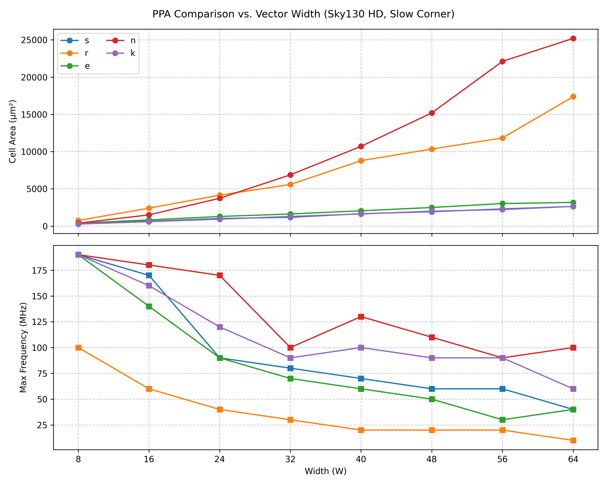

# U

[](https://github.com/cocotb/cocotb)
[](https://ieeexplore.ieee.org/document/8299595)
[](https://github.com/google/skywater-pdk)

## Synopsis

PPA comparison of four RTL styles for offset leading-zero detection using cocotb verification and open-source synthesis flow.

## Problem Statement

An arbitrary W-bit vector (x) is present along with a bit position
within it (pos). The output is a W-bit vector (y) denoting the
position of the first '0' encountered when walking through
each bit rightward from 'pos,' modulo the vector width. An 'any'
flag is present to denote the case when the output is valid.

Examples as follows:

| x                   | pos | y                   | y_enc  | any
|---------------------|:---:|---------------------|:-----:|:----:
| 1111_1111_1111_1110 |   0 | 0000_0000_0000_0001 |  0     |  1
| 0000_0000_0000_0000 |   0 | 1000_0000_0000_0000 |  15    |  1
| 0000_0000_0000_0000 |   1 | 0000_0000_0000_0001 |  0     |  1
| 0000_0000_0000_0000 |  15 | 0100_0000_0000_0000 |  14    |  1
| 0010_1010_0011_0111 |   8 | 0000_0000_1000_0000 |  7     |  1
| 1111_1111_1111_1111 |   x | xxxx_xxxx_xxxx_xxxx |  x     |  0

## Realizations

The following circuits are presented:

#### (E) Explicit [e.sv](./rtl/e/e.sv):

Prioritization is performed (E)xplicitly using PLA-based 
[lookup-tables](./rtl/e/e_priority.sv), synthesized to random logic 
using the ABC synthesis tool. Tables are chained to larger vector-widths 
using a CLA-style kill/propagate/generate lookahead network. Solution is 
noteworthy due to the use of explicit PLA-tables which require an 
additional intermediate RTL rendering step before simulation/synthesis.

#### (R) Rotator [r.sv](./rtl/s/s.sv):

Brute-Force implementation where the input vector is rotated to a
known position, prioritization applied to detect the presence of a '0',
and then rotated back to its original location. The solution relies
on a long combinatorial path through two priority networks and
barrel-shifer and may therefore present a timing concern.

#### (S) Special [s.sv](./rtl/s/s.sv):

Mask-based solution where two halfs are computed: those preceding
pos, and those succeeding (inclusive). In the case of the preceding
half, a mask is computed to set all bits of the succeeding half to '1'.
The first zero is then computed by reversing both vectors and incrementing.
The first bit to transition from '0' to '1' is the carry-out and the
first '0' in the vector.

Solution relies on an incrementer for '0' detection which allows synthesis
to infer a fast-lookahead structure as necessary.

#### (N) Naive [n.sv](./rtl/n/n.sv):

"Naive", Brute-Force solution. For each possible value of 'pos', infer
an prioritization network to detect the first '0'. For a given value
of 'pos', mux out the appropriate vector.

As a new priorization network is infered for each possible value of 'pos',
rotation and mask logic can be avoided. This ought to result in
good timing behaviour. As logic is duplicated proportional to O(W),
area ought to grow linearly with 'W'.


## Verification


Verification is performed using cocotb and Verilator. Although the
designs are themselves fully combinatorial, they are flop bounded
in the testbench top-level. The diagram shown above therefore illustrates
the two-cycle latency between input to output. Test cases are as follows:

### [Randomized](./src/tb/tests.py#L173)
To test 10000 random vector, 'pos' tuples for correctness.

### [Edge Cases](./src/tb/tests.py#L192)
To test boundary cases such as all-ones and all-zeros for a sweap of 'pos'.

### [Directed](./src/tb/tests.py#L150)
To test the specific input stimulus cases as presented in the "Problem Statement" section of this document.

## Physical Analysis



### Discussion

As expected, the long, critical path of 'r' inhibits its ability to
reach high F over increasing W. Similarly, 'n' does not scale with 'W'
but achieves a higher F when compared to the other solutions. The overall
area performance of 's' and 'e' remain similar and area growth with 'W'
is very good. It seems however that the hand-optimized lookup table solution
of 'e' does not perform as well as the synthesized PLA of 's'.

### Methodology


The RTL for each realization was wrapped in a flop-bounding top-level, and 
synthesized using the Yosys/Synlig open-source synthesis tool. The 130nm (HD) 
SkyWater PDK was used at the 1.60v/100c corner. The resultant netlist
was passed to OpenSTA and a timing sweap performed to compute the highest
frequency with zero Total Negative Slack (TNS). SkyWater does not provide
Wire Load Models (WLM) so timing analysis was performed in the absence of
wire-delay.

#### Limitation

Wire-delay cannot be ignored in timing analysis. It is typically
estimated using statistical Wire-Load Models (WLM) during synthesis,
and using parasitic extraction in the backend after routing. In this context, 
it is impossible to fully recreate a modern ASICflow, so these limitations 
are unavoidable.

Cell area is only a portion of the overall circuit area in silicon. Total
area is influence by wiring-congestion, utilization, routability and
floorplanning. The area figures presented therefore are an unestimate
of the true silicon area, which may scale by some unknown function of
the design.

## Instructions

The flow is scripted using Python. Verification is performed using
cocotb and Verilator. Synthesis is performed using Berkley's ABC
Synthesis tool, the Synlig front-end for Yosys and OpenSTA.

The [Dockerfile](./devcontainer/Dockerfile) is the recommended
environment for this project. 

### Installation

Performs necessary installation into the Python virtual-environment
and installs all tools.

```
poetry install
```

### Simulation

A design can be tested by invoking:

```
poetry run driver -p $PROJECT -w $WIDTH
```

Where "$PROJECT" and "$WIDTH" denote the project and its width
respectively.

### Regresssion

A full regression can be invoked using:

```
poetry run regress
```

This invokes the verification flow for each design across a 'W'
sweap and various parameterizations.

### Synthesis

To invoke synthesis, run the following command:

```
poetry run syn
```

This command shall recreate the PNG file illustrating area/frequency
performance of each design across 'W'.
